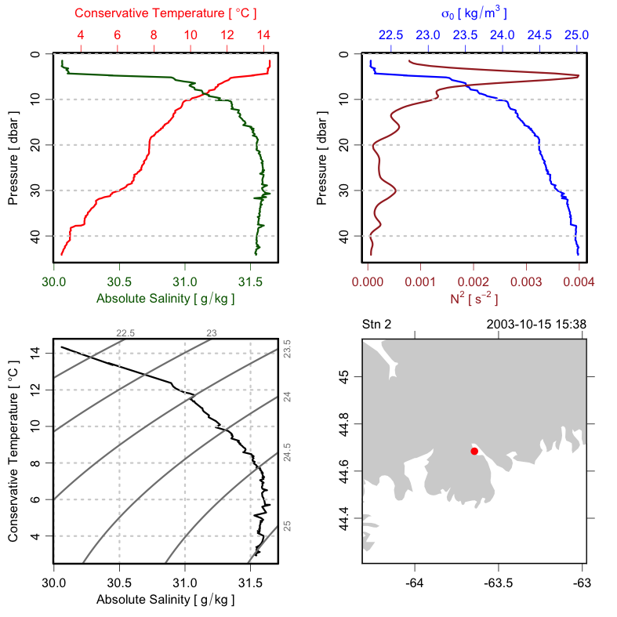
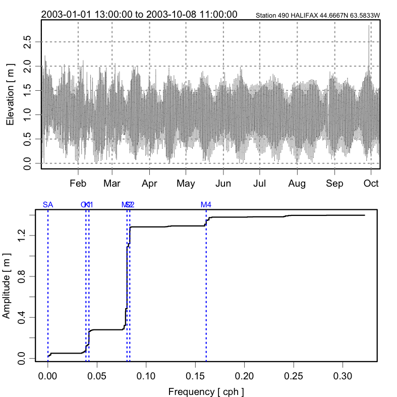
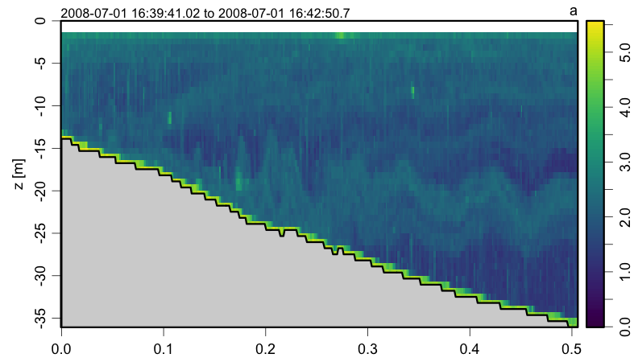
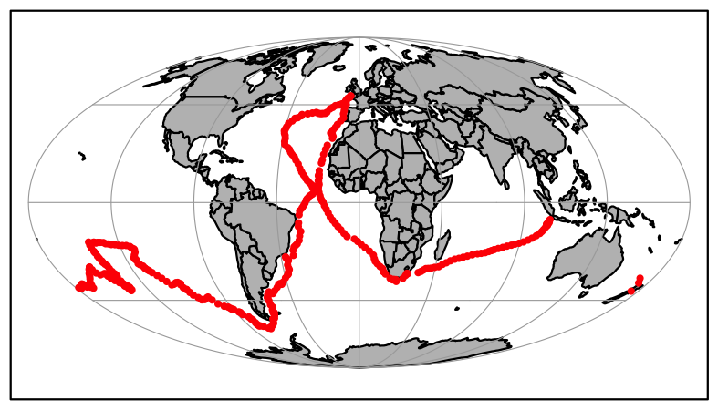

# **oce** 


[](https://github.com/dankelley/oce/actions)
[](https://codecov.io/gh/dankelley/oce?branch=develop)
[](https://cran.r-project.org/package=oce)


[](http://www.rdocumentation.org/packages/oce)


## About oce

Oce is an R package for processing oceanographic data.  Its
[webpage](http://dankelley.github.com/oce/) provides details, of which this
README file is just a sketch.  A book by one of the oce co-authors provides
more information on the package and its potential for oceanographic research
(Kelley, Dan E., 2018. [Oceanographic Analysis with
R](https://www.springer.com/us/book/9781493988426).  New York.
Springer-Verlag).

## Installing oce

Stable versions of oce are installed from within R, in the same way as
other packages.  However, this version is only updated a few times a year
(pursuant to CRAN policy), so many users install the `"develop"` branch
instead. This branch may be updated several times per day, as the authors fix
bugs or add features that are motivated by day-to-day usage.  This is the
branch favoured by users who need new features or who would wish to contribute to
Oce development.

The easy way to install the `"develop"` branch is to execute the
following commands in R.
```R
remotes::install_github("dankelley/oce", ref="develop")
```
and most readers should also install Ocedata, with
```R
remotes::install_github("dankelley/ocedata", ref="master")
```

## Evolution of oce

Oce is emphatically an open-source system, and so the participation of users is
very important.  This is why Git is used for version control of the Oce source
code, and why GitHub is the host for that code.  Users are invited to take
part in the development process, by suggesting features, by reporting bugs, or
just by watching as others do such things.  Oceanography is a collaborative
discipline, so it makes sense that the evolution of Oce be similarly
collaborative.

## Examples using built-in datasets

### CTD
```R
library(oce)
data(ctd)
plot(ctd, which=c(1,2,3,5))
```


### Acoustic Doppler profiler
```R
library(oce)
data(adp)
plot(adp)
```


### Sealevel and tides
```R
library(oce)
library(oce)
data(sealevelHalifax)
m <- tidem(sealevelHalifax)
par(mfrow=c(2,1))
plot(sealevelHalifax, which=1)
plot(m)
```



### Echosounder
```R
library(oce)
data(echosounder)
plot(echosounder, which=2, drawTimeRange=TRUE, drawBottom=TRUE)
```



### Map
```R
library(oce)
par(mar=rep(0.5, 4))
data(endeavour, package="ocedata")
data(coastlineWorld, package="oce")
mapPlot(coastlineWorld, col='gray')
mapPoints(endeavour$longitude, endeavour$latitude, pch=20, col='red')
```



### Landsat image
```R
library(ocedata)
library(oce)
data(landsat)
plot(landsat)
```


