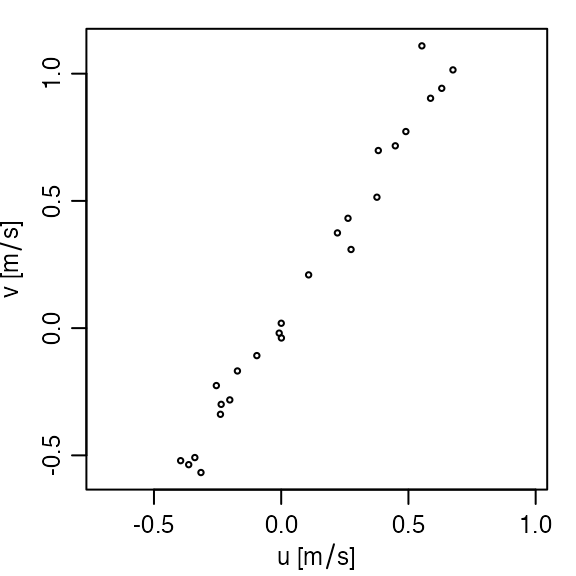

# 3. Analysis of acoustic-Doppler data

**Abstract.** This vignette explains the basics of using the oce package
to handle measurements made by both mooring and ship based acoustic
Doppler profilers. As in the related vignette about working with
[data-quality
flags](https://dankelley.github.io/oce/articles/E_flags.md), the
material is organized to reflect typical workflow. See [the main oce
vignette](https://dankelley.github.io/oce/articles/A_oce.md) for general
information about oce. The sample code provided here relies on the oce
package, loaded as follows.

``` r
library(oce)
#> Loading required package: gsw
```

## Reading adp files

Acoustic Doppler profiling instruments are called ADCPs by some
manufacturers and ADPs by others. The class name `adp` is used in oce,
to handle both types. It is important to realize that there are *many*
data formats for data of this type, and that the files are normally in a
dense binary format that cannot be read with a text editor. It is
necessary to use software to work with such files. Although oce can
handle many file formats, and although its authors do their best to keep
up with changes to file formats (at least for popular instruments),
users will sometimes be forced to use manufacturer software to read the
data, or at least convert to a format that can be manually read into R,
and then converted to an `adp` object using the
[`as.adp()`](https://dankelley.github.io/oce/reference/as.adp.md)
function.

Suppose `f` is a character string naming a data file. In many cases,

``` r
d <- read.oce(f)
```

will read the file, because `read.oce` will look inside the file to try
to guess the format. If this does not work, one ought to try e.g.

``` r
d <- read.adp(f)
```

which, again, will try to determine which subtype of adp file has been
provided. If that fails, it might help to try a specialized function,
such as
[`read.adp.rdi()`](https://dankelley.github.io/oce/reference/read.adp.rdi.md)
for an RDI file,
[`read.adp.nortek()`](https://dankelley.github.io/oce/reference/read.adp.nortek.md)
for a Nortek file, or
[`read.adp.sontek()`](https://dankelley.github.io/oce/reference/read.adp.sontek.md)
for a Sontek file. (Actually, each of these can handle a variety of
sub-formats).

If any of these `read.` functions is called with just a single argument
naming the file, then the entire dataset will be read in. This can be
slow for large files (e.g. taking of order 0.1s per Mb), and so it can
help to use the `by` argument, e.g. for a 138Mb file on the author’s
computer,

``` r
f <- "/data/archive/sleiwex/2008/moorings/m09/adp/rdi_2615/raw/adp_rdi_2615.000"
dall <- read.oce(f)
```

takes 15.2s of user time, but

``` r
d100 <- read.oce(f, by = 100)
```

takes 0.2s. It is also possible to window the data, using the `from` and
`to` arguments, which (like `by`) can be integers that count ensembles
(or “profiles”) or a POSIX time (see
[`?read.adp`](https://dankelley.github.io/oce/reference/read.adp.md)).
For example, the adp dataset provided by oce was read with

``` r
read.oce(f,
    from = as.POSIXct("2008-06-26", tz = "UTC"),
    to = as.POSIXct("2008-06-27", tz = "UTC"),
    by = "60:00",
    latitude = 47.88126, longitude = -69.73433
)
```

with `f` as defined above. This also illustrates that it is possibly to
specify the location of an instrument; the further processing that was
done to create `data(adp)` will be explained in due course.

\+**Note**: Users who are not familiar with ADP data may noticed that
there is a combination of many file types when dealing with ADP data.
Some of these include: .ENR, which are raw data only received from the
ADP, .ENS, similar to .ENR but also contain data merged from other file
types without processing, .ENX, merged data that are processed including
calculations to transformed data including east, north, and vertical
velocities, .STA, which are a short term average of measurements, and
.LTA, which are a long term average of measurements.

## Summarizing adp data

The generic function `summary` provides a useful overview of an adp data
object. For example,

``` r
data(adp)
summary(adp)
```

(results not shown the goal is to encourage the user to try this!) shows
the sort of information normally present in an RDI file. Other
manufacturer types will have somewhat different summaries, because both
the metadata and the data differ from instrument to instrument. In all
cases, there will be a vector holding time (named `time`), another
holding the distance from instrument to the centre of a measurement bin,
measured along a line equidistant between the beams (named `distance`),
along with an array holding velocity (named `v`). (Other arrays may
include, as in this RDI case, `q` for data quality, `a` for backscatter
amplitude, and `g` for percentage goodness.)

Note that the summary reveals that instrument had been set up to record
in `beam` coordinates, but that processing had been done to convert to
`enu` (east-north-up) coordinates.

**Exercise 1.** Determine the name of the `metadata` item that holds the
coordinate system of an adp object.

After completing Exercise 1, the user will notice that both `latitude`
and `longitude` are available in the metadata for this built-in, moored,
adp dataset. It should be noted that if this dataset was a ship-based
adp dataset, then `latitude` and `longitude` would not be included.
Instead, the data would include `firstLatitude`, `firstLongitude`,
`lastLatitude`, and `lastLongitude`, which provide an indication of the
ship drift during sampling.

## Changing coordinate systems

It is critical for analysts to be aware of the coordinate system of an
adp dataset, simply because those systems are so different. In what oce
calls the `beam` system, velocities in each of the acoustic beams are
measured along the slant angle of the beam. These data may be combined
(using a transformation matrix which is part of the metadata displayed
with the [`summary()`](https://rdrr.io/r/base/summary.html) function)
into what oce calls a `xyz` system that is Cartesian and fixed to the
instrument. Since instruments record heading, pitch, and roll, the `xyz`
velocities can be converted easily to `enu` velocities.

In some applications, the scientific focus is primarily on the `enu`
data, but it is a good idea to calculate and study the data at all
stages of processing. Thus, although the
[`toEnu()`](https://dankelley.github.io/oce/reference/toEnu.md) function
will convert data measured in any coordinate system into an `enu`
variant, many analysts will do something along the lines of

``` r
beam <- read.oce(f)
xyx <- beamToXyz(beam)
enu <- xyzToEnu(xyz, declination = -18.1)
```

where the declination illustrated is the value used in creating the
`data(adp)` dataset. (Compensating for declination is necessary because
compasses are calibrated at a particular place and time, and compasses
have no way of “knowing” the local angle between true north and magnetic
north.)

## Plotting

The generic [`plot()`](https://rdrr.io/r/graphics/plot.default.html)
function is specialized to handle adp objects in a variety of simple but
helpful ways. The type of plot is determined by the `which` argument.
The default for `which` is to create a multi-panel image plot that shows
time-space dependence for each velocity component. The number of panels
depends on the number of beams used by the instrument, and each one has
a label indicating the component name. For example,

``` r
plot(adp)
```


has velocity panels named `east`, `north` and `up`, along with one named
`error`, which is an estimate of the velocity-inference error.

Options to this plot variant can be used to control how distance from
instrument is shown (which can be useful in visualizing data from
upward- and downward-aligned instruments), what colours are used to
represent the signals, etc.

Dozens of other plot types are also provided; see
[`?"plot,adp-method"`](https://dankelley.github.io/oce/reference/plot-adp-method.md)
for details – but be warned that a complex plot requires many arguments!

When dealing with ship-based adp data, in order to get the true `east`,
`north`, and `up` velocity, the user must remove the speed of the ship.
To do this, use the
[`subtractBottomVelocity()`](https://dankelley.github.io/oce/reference/subtractBottomVelocity.md)
function, which subtracts the bottom tracking velocities from an adp
object.

**Exercise 2.** Create a u-v scatterplot.

**Exercise 3.** Write the steps to plot the `east`, `north`, and `up`
velocity without the speed of the ship for a file named
`COR2019002_20190818T064815_007_000000.ENS`.

## Subsetting

Adp data can be subsetted in a wide variety of ways, e.g.

``` r
plot(subset(adp, distance < 20))
```


plots only data within 20m of the instrument. See
[`?"subset,adp-method"`](https://dankelley.github.io/oce/reference/subset-adp-method.md)
for more on subsetting.

**Exercise 4.** Plot the adp data for the first half of the sampling
interval.

## Accessing data within adp objects

All oce objects share a common framework, with so-called “slots” for
metadata, data, and processing log. It is possible to examine, and
modify, the elements of each of these slots using base R constructs, but
it is usually better to use oce accessor functions. The details are
provided with
[`?"[[,adp-method"`](https://dankelley.github.io/oce/reference/sub-sub-adp-method.md)
and
[`?"[[<-,adp-method"`](https://dankelley.github.io/oce/reference/sub-subset-adp-method.md),
but a few examples should suffice to sketch the general pattern.

For example,

``` r
time <- adp[["time"]]
distance <- adp[["distance"]]
```

extracts the times and distances of the profiles within `data(adp)`,
while the array holding the velocities is extract with

``` r
v <- adp[["v"]]
```

Altering values uses the `[[` to the left of the assignment operator,
but this is not commonly required in simple work, so it is best for
readers to focus first on accessing data. The exercises may help with
this.

Some of the fields contained in adp objects, particularly the amplitude,
correlation, and percent good fields (`a`, `q`, and `g`) are stored as
`raw`-type. This is done primarily to save memory space, as expanded all
of those fields into `numeric` types can be slow and they get large
quickly. However, to actually work with the numbers, users can extract a
“numeric” version by supplying the second argument to the `[[` function,
e.g.

``` r
a <- adp[["a", "numeric"]]
```

This has the advantage of returning an object with the same matrix
dimensions as the original (note that functions like
[`as.numeric()`](https://rdrr.io/r/base/numeric.html) typically discard
dimension information, thereby converting an array to a vector).

**Exercise 5.** Plot a time series of mid-depth and depth-averaged
eastward velocities.

**Exercise 6.** Perform an eigen-analysis of eastward and northward
velocity.

**Exercise 7.** Plot a time series of pressure variations, to reveal
tidal height.

## Solutions to exercises

**Exercise 1.** Determine the name of the `metadata` item that holds the
coordinate system of an adp object.

**Solution.**

With adp as loaded in the text, we may the names in the metadata with:

``` r
sort(names(adp[["metadata"]]))
```

(results not shown), after which a keen eye will notice that two
elements relate to coordinates:

``` r
adp[["originalCoordinate"]]
#> [1] "beam"
adp[["oceCoordinate"]]
#> [1] "enu"
```

and comparison with the output of `summary(adp)` reveals that the former
is the coordinate system in which the data were originally measured,
while the latter is the coordinate system of the transformed data. Using

``` r
processingLogShow(adp)
#> * Processing Log
#> 
#>     - 2019-08-12 15:29:36 UTC: `read.oce("/data/archive/sleiwex/2008/moorings/m09/adp/rdi_2615/raw/adp_rdi_2615.000", ...)`
#>     - 2019-08-12 15:29:36 UTC: `beamToXyzAdp(x = beam)`
#>     - 2019-08-12 15:29:36 UTC: `xyzToEnuAdp(x, declination=-18.1, debug=0)`
```

reveals the steps in the data transformation.

**Exercise 2.** Create a u-v scatterplot.

**Solution.**

``` r
plot(adp, which = "uv")
```



**Exercise 3.** Write the steps to plot the `east`, `north`, and `up`
velocity without the speed of the ship for a file named
`COR2019002_20190818T064815_007_000000.ENS`.

**Solution.**

``` r
library(oce)
adcp <- read.adp("COR2019002_20190818T064815_007_000000.ENS")
enu <- toEnu(adcp)
removeShipSpeed <- subtractBottomVelocity(enu)
plot(removeShipSpeed, which = 1:3)
```

**Exercise 4.** Plot the adp data for the first half of the sampling
interval.

**Solution.** (results not shown)

``` r
plot(subset(adp, time < median(adp[["time"]])))
```

**Exercise 5.** Plot a time series of mid-depth and depth-averaged
eastward velocities.

**Solution.**

``` r
time <- adp[["time"]]
v <- adp[["v"]]
# The second index is for bin number, the third for beam number
midIndex <- dim(v)[2] / 2
eastMid <- v[, midIndex, 1] # third index is beam
distance <- adp[["distance"]][midIndex]
oce.plot.ts(time, eastMid, ylab = "Eastward velocity [m/s]")
# Depth mean; note that na.rm, is passed by apply() to mean()
eastMean <- apply(v[, , 1], 1, mean, na.rm = TRUE)
lines(time, eastMean, col = 2)
```


Here,
[`oce.plot.ts()`](https://dankelley.github.io/oce/reference/oce.plot.ts.md)
is used instead of the basic R function
[`plot()`](https://rdrr.io/r/graphics/plot.default.html), because it
provides a margin note on the detailed time interval.

**Exercise 6.** Perform an eigen-analysis of eastward and northward
velocity.

**Solution.**

``` r
u <- adp[["v"]][, , 1]
v <- adp[["v"]][, , 2]
ok <- is.finite(u) & is.finite(v) # remove NA values
u <- u[ok]
v <- v[ok]
eigen(cov(data.frame(u, v)))
#> eigen() decomposition
#> $values
#> [1] 0.48350161 0.01557049
#> 
#> $vectors
#>           [,1]       [,2]
#> [1,] 0.5441538 -0.8389855
#> [2,] 0.8389855  0.5441538
```

Note that this action is equivalent to principal component analysis, and
it might be wiser to use

``` r
pr <- prcomp(data.frame(u, v))
```

to do the analysis, which yields the same principal axes

``` r
pr
#> Standard deviations (1, .., p=2):
#> [1] 0.6953428 0.1247818
#> 
#> Rotation (n x k) = (2 x 2):
#>         PC1        PC2
#> u 0.5441538 -0.8389855
#> v 0.8389855  0.5441538
```

but has the advantage of having associated methods, including for
plotting.

**Exercise 7.** Plot a time series of pressure variations, to reveal
tidal height.

**Solution.**

``` r
time <- adp[["time"]]
pressure <- adp[["pressure"]]
oce.plot.ts(time, pressure)
```


As a matter of interest, a tidal analysis may be done with

``` r
m <- tidem(as.sealevel(pressure, time))
#> Warning in tidem(as.sealevel(pressure, time)): tidal record too short to fit
#> constituents: SA, SSA, MSM, MM, MSF, MF, ALP1, 2Q1, SIG1, Q1, RHO1, O1, TAU1,
#> BET1, NO1, CHI1, PI1, P1, S1, PSI1, PHI1, THE1, J1, SO1, OO1, UPS1, OQ2, EPS2,
#> 2N2, MU2, N2, NU2, GAM2, H1, H2, MKS2, LDA2, L2, T2, S2, R2, K2, MSN2, ETA2,
#> MO3, M3, SO3, MK3, SK3, MN4, M4, SN4, MS4, MK4, S4, SK4, 2SK5, 2MN6, M6, 2MS6,
#> 2MK6, 2SM6, MSK6, M8
```

where the list of undetermined tidal constituents is long, because this
tidal record is so short (see
[`?tidem`](https://dankelley.github.io/oce/reference/tidem.md)). The
fitted constituents are as follows

``` r
summary(m)
#> tidem summary
#> -------------
#> 
#> Call:
#> tidem(t = as.sealevel(pressure, time))
#> RMS misfit to data:  0.06615227 
#> 
#> Fitted Model:
#>         Freq Amplitude Phase       p    
#> Z0    0.0000   39.0465   0.0 < 2e-16 ***
#> K1    0.0418    0.0689 334.9   0.089 .  
#> M2    0.0805    1.1730 203.8 4.6e-16 ***
#> 2MK5  0.2028    0.0312 112.8   0.417    
#> 3MK7  0.2833    0.0265  87.8   0.618    
#> ---
#> Signif. codes:  0 '***' 0.001 '**' 0.01 '*' 0.05 '.' 0.1 ' ' 1
#> * Processing Log
#> 
#>     - 2026-03-16 15:50:47 UTC: `create 'tidem' object`
#>     - 2026-03-16 15:50:47 UTC: `tidem(t = as.sealevel(pressure, time))`
```

(Note that it fitted for M2, but not S2, because the Rayleigh criterion
prevents inferring both, and the conventional tidal analysis favours M2
over S2 if the time series is too short to fit for more than one
semi-diurnal constituent.)

A useful step might be to draw a tidal fit along with the data. It makes
sense to construct a finer time grid, to get a smooth curve, as in the
following (see
[`?predict.tidem`](https://dankelley.github.io/oce/reference/predict.tidem.md)).

``` r
oce.plot.ts(time, pressure, type = "p", col = "blue")
timePredict <- seq(min(time), max(time), length.out = 200)
pressurePredict <- predict(m, timePredict)
lines(timePredict, pressurePredict, col = "red")
```


