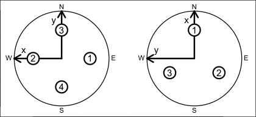
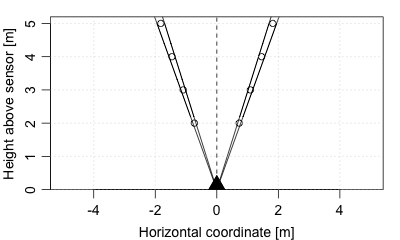

# Class to Store Acoustic-Doppler Profiler Data

This class stores data from acoustic Doppler profilers. Some
manufacturers call these ADCPs, while others call them ADPs; here the
shorter form is used by analogy to ADVs.

## Slots

- `data`:

  As with all `oce` objects, the `data` slot for `adp` objects is a
  [list](https://rdrr.io/r/base/list.html) containing the main data for
  the object. The key items stored in this slot include `time`,
  `distance`, and `v`, along with angles `heading`, `pitch` and `roll`.

- `metadata`:

  As with all `oce` objects, the `metadata` slot for `adp` objects is a
  [list](https://rdrr.io/r/base/list.html) containing information about
  the `data` or about the object itself. Examples that are of common
  interest include `oceCoordinate`, `orientation`, `frequency`, and
  `beamAngle`.

- `processingLog`:

  As with all `oce` objects, the `processingLog` slot for `adp` objects
  is a [list](https://rdrr.io/r/base/list.html) with entries describing
  the creation and evolution of the object. The contents are updated by
  various `oce` functions to keep a record of processing steps. Object
  summaries and
  [`processingLogShow()`](https://dankelley.github.io/oce/reference/processingLogShow.md)
  both display the log.

## Modifying slot contents

Although the `[[<-` operator may permit modification of the contents of
adp objects (see `[[<-,adp-method`), it is better to use
[`oceSetData()`](https://dankelley.github.io/oce/reference/oceSetData.md)
and
[`oceSetMetadata()`](https://dankelley.github.io/oce/reference/oceSetMetadata.md),
because those functions save an entry in the `processingLog` that
describes the change.

## Retrieving slot contents

The full contents of the `data` and `metadata` slots of a adp object may
be retrieved in the standard R way using
[`slot()`](https://rdrr.io/r/methods/slot.html). For example
`slot(o,"data")` returns the `data` slot of an object named `o`, and
similarly `slot(o,"metadata")` returns the `metadata` slot.

The slots may also be obtained with the
[`[[,adp-method`](https://dankelley.github.io/oce/reference/sub-sub-adp-method.md)
operator, as e.g. `o[["data"]]` and `o[["metadata"]]`, respectively.

The
[`[[,adp-method`](https://dankelley.github.io/oce/reference/sub-sub-adp-method.md)
operator can also be used to retrieve items from within the `data` and
`metadata` slots. For example, `o[["temperature"]]` can be used to
retrieve temperature from an object containing that quantity. The rule
is that a named quantity is sought first within the object's `metadata`
slot, with the `data` slot being checked only if `metadata` does not
contain the item. This `[[` method can also be used to get certain
derived quantities, if the object contains sufficient information to
calculate them. For example, an object that holds (practical) salinity,
temperature and pressure, along with longitude and latitude, has
sufficient information to compute Absolute Salinity, and so `o[["SA"]]`
will yield the calculated Absolute Salinity.

It is also possible to find items more directly, using
[`oceGetData()`](https://dankelley.github.io/oce/reference/oceGetData.md)
and
[`oceGetMetadata()`](https://dankelley.github.io/oce/reference/oceGetMetadata.md),
but neither of these functions can retrieve derived items.

## Reading/creating `adp` objects

The `metadata` slot contains various items relating to the dataset,
including source file name, sampling rate, velocity resolution, velocity
maximum value, and so on. Some of these are particular to particular
instrument types, and prudent researchers will take a moment to examine
the whole contents of the metadata, either in summary form (with
`str(adp[["metadata"]])`) or in detail (with `adp[["metadata"]]`).
Perhaps the most useful general properties are `adp[["bin1Distance"]]`
(the distance, in metres, from the sensor to the bottom of the first
bin), `adp[["cellSize"]]` (the cell height, in metres, in the vertical
direction, *not* along the beam), and `adp[["beamAngle"]]` (the angle,
in degrees, between beams and an imaginary centre line that bisects all
beam pairs).

The diagram provided below indicates the coordinate-axis and
beam-numbering conventions for three- and four-beam ADP devices, viewed
as though the reader were looking towards the beams being emitted from
the transducers.

The bin geometry of a four-beam profiler is illustrated below, for
`adp[["beamAngle"]]` equal to 20 degrees, `adp[["bin1Distance"]]` equal
to 2m, and `adp[["cellSize"]]` equal to 1m. In the diagram, the viewer
is in the plane containing two beams that are not shown, so the two
visible beams are separated by 40 degrees. Circles indicate the centres
of the range-gated bins within the beams. The lines enclosing those
circles indicate the coverage of beams that spread plus and minus 2.5
degrees from their centreline.

Note that `adp[["oceCoordinate"]]` stores the present coordinate system
of the object, and it has possible values `"beam"`, `"xyz"`, `"sfm"` or
`"enu"`. (This should not be confused with
`adp[["originalCoordinate"]]`, which stores the coordinate system used
in the original data file.)

The `data` slot holds some standardized items, and many that vary from
instrument to instrument. One standard item is `adp[["v"]]`, a
three-dimensional numeric array of velocities in m/s. In this matrix,
the first index indicates time, the second bin number, and the third
beam number. The meaning of beams number depends on whether the object
is in beam coordinates, frame coordinates, or earth coordinates. For
example, if in earth coordinates, then beam 1 is the eastward component
of velocity. Thus, for example,

    library(oce)
    data(adp)
    t <- adp[["time"]]
    d <- adp[["distance"]]
    eastward <- adp[["v"]][,,1]
    imagep(t, d, eastward, missingColor="gray")

plots an image of the eastward component of velocity as a function of
time (the x axis) and distance from sensor (y axis), since the `adp`
dataset is in earth coordinates. Note the semidurnal tidal signal, and
the pattern of missing data at the ocean surface (gray blotches at the
top).

Corresponding to the velocity array are two arrays of type raw, and
identical dimension, accessed by `adp[["a"]]` and `adp[["q"]]`, holding
measures of signal strength and data quality (referred to as
"correlation" in some documentation), respectively. (The exact meanings
of these depend on the particular type of instrument, and it is assumed
that users will be familiar enough with instruments to know both the
meanings and their practical consequences in terms of data-quality
assessment, etc.)

In addition to the arrays, there are time-based vectors. The vector
`adp[["time"]]` (of length equal to the first index of `adp[["v"]]`,
etc.) holds times of observation. Depending on type of instrument and
its configuration, there may also be corresponding vectors for sound
speed (`adp[["soundSpeed"]]`), pressure (`adp[["pressure"]]`),
temperature (`adp[["temperature"]]`), heading (`adp[["heading"]]`) pitch
(`adp[["pitch"]]`), and roll (`adp[["roll"]]`), depending on the setup
of the instrument.

The precise meanings of the data items depend on the instrument type.
All instruments have `v` (for velocity), `q` (for a measure of data
quality) and `a` (for a measure of backscatter amplitude, also called
echo intensity). Teledyne-RDI profilers have an additional item `g` (for
percent-good).

VmDas-equipped Teledyne-RDI profilers additional navigation data, with
details listed in the table below; note that the RDI documentation
(reference 2) and the RDI gui use inconsistent names for most items.

|  |  |  |
|----|----|----|
| **Oce name** | **RDI doc name** | **RDI GUI name** |
| `avgSpeed` | Avg Speed | Speed/Avg/Mag |
| `avgMagnitudeVelocityEast` | Avg Mag Vel East | ? |
| `avgMagnitudeVelocityNorth` | Avg Mag Vel North | ? |
| `avgTrackMagnetic` | Avg Track Magnetic | Speed/Avg/Dir (?) |
| `avgTrackTrue` | Avg Track True | Speed/Avg/Dir (?) |
| `avgTrueVelocityEast` | Avg True Vel East | ? |
| `avgTrueVelocityNorth` | Avg True Vel North | ? |
| `directionMadeGood` | Direction Made Good | Speed/Made Good/Dir |
| `firstLatitude` | First latitude | Start Lat |
| `firstLongitude` | First longitude | Start Lon |
| `firstTime` | UTC Time of last fix | End Time |
| `lastLatitude` | Last latitude | End Lat |
| `lastLongitude` | Last longitude | End Lon |
| `lastTime` | UTC Time of last fix | End Time |
| `numberOfHeadingSamplesAveraged` | Number heading samples averaged | ? |
| `numberOfMagneticTrackSamplesAveraged` | Number of magnetic track samples averaged | ? |
| `numberOfPitchRollSamplesAvg` | Number of magnetic track samples averaged | ? |
| `numberOfSpeedSamplesAveraged` | Number of speed samples averaged | ? |
| `numberOfTrueTrackSamplesAvg` | Number of true track samples averaged | ? |
| `primaryFlags` | Primary Flags | ? |
| `shipHeading` | Heading | ? |
| `shipPitch` | Pitch | ? |
| `shipRoll` | Roll | ? |
| `speedMadeGood` | Speed Made Good | Speed/Made Good/Mag |
| `speedMadeGoodEast` | Speed MG East | ? |
| `speedMadeGoodNorth` | Speed MG North | ? |

For Teledyne-RDI profilers, there are four three-dimensional arrays
holding beamwise data. In these, the first index indicates time, the
second bin number, and the third beam number (or coordinate number, for
data in `xyz`, `sfm`, `enu` or `other` coordinate systems). In the list
below, the quoted phrases are quantities as defined in Figure 9 of
reference 1.

- `v` is `velocity` in m/s, inferred from two-byte signed integer values
  (multiplied by the scale factor that is stored in `velocityScale` in
  the metadata).

- `q` is "correlation magnitude" a one-byte quantity stored as type
  `raw` in the object. The values may range from 0 to 255.

- `a` is "backscatter amplitude", also known as "echo intensity" a
  one-byte quantity stored as type `raw` in the object. The values may
  range from 0 to 255.

- `g` is "percent good" a one-byte quantity stored as `raw` in the
  object. The values may range from 0 to 100.

Finally, there is a vector `adp[["distance"]]` that indicates the bin
distances from the sensor, measured in metres along an imaginary centre
line bisecting beam pairs. The length of this vector equals
`dim(adp[["v"]])[2]`.

## Teledyne-RDI Sentinel V ADCPs

As of 2016-09-27 there is provisional support for the TRDI "SentinelV"
ADCPs, which are 5 beam ADCPs with a vertical centre beam. Relevant
vertical beam fields are called `adp[["vv"]]`, `adp[["va"]]`,
`adp[["vq"]]`, and `adp[["vg"]]` in analogy with the standard 4-beam
fields.

## Accessing and altering information within adp objects

*Extracting values* Matrix data may be accessed as illustrated above,
e.g. or an adp object named `adv`, the data are provided by
`adp[["v"]]`, `adp[["a"]]`, and `adp[["q"]]`. As a convenience, the last
two of these can be accessed as numeric (as opposed to raw) values by
e.g. `adp[["a", "numeric"]]`. The vectors are accessed in a similar way,
e.g. `adp[["heading"]]`, etc. Quantities in the `metadata` slot are also
available by name, e.g. `adp[["velocityResolution"]]`, etc.

*Assigning values.* This follows the standard form, e.g. to increase all
velocity data by 1 cm/s, use `adp[["v"]] <- 0.01 + adp[["v"]]`.

*Overview of contents* The `show` method (e.g. `show(d)`) displays
information about an ADP object named `d`.

## Dealing with suspect data

There are many possibilities for confusion with `adp` devices, owing
partly to the flexibility that manufacturers provide in the setup.
Prudent users will undertake many tests before trusting the details of
the data. Are mean currents in the expected direction, and of the
expected magnitude, based on other observations or physical constraints?
Is the phasing of currents as expected? If the signals are suspect,
could an incorrect scale account for it? Could the transformation matrix
be incorrect? Might the data have exceeded the maximum value, and then
“wrapped around” to smaller values? Time spent on building confidence in
data quality is seldom time wasted.

## References

1.  Teledyne-RDI, 2007. *WorkHorse commands and output data format.* P/N
    957-6156-00 (November 2007).

2.  Teledyne-RDI, 2012. *VmDas User's Guide, Ver. 1.46.5*.

## See also

A file containing ADP data is usually recognized by Oce, and so
[`read.oce()`](https://dankelley.github.io/oce/reference/read.oce.md)
will usually read the data. If not, one may use the general ADP function
[`read.adp()`](https://dankelley.github.io/oce/reference/read.adp.md) or
specialized variants
[`read.adp.rdi()`](https://dankelley.github.io/oce/reference/read.adp.rdi.md),
[`read.adp.nortek()`](https://dankelley.github.io/oce/reference/read.adp.nortek.md),
[`read.adp.ad2cp()`](https://dankelley.github.io/oce/reference/read.adp.ad2cp.md),
[`read.adp.sontek()`](https://dankelley.github.io/oce/reference/read.adp.sontek.md)
or
[`read.adp.sontek.serial()`](https://dankelley.github.io/oce/reference/read.adp.sontek.serial.md).

ADP data may be plotted with
[`plot,adp-method()`](https://dankelley.github.io/oce/reference/plot-adp-method.md),
which is a generic function so it may be called simply as `plot`.

Statistical summaries of ADP data are provided by the generic function
`summary`, while briefer overviews are provided with `show`.

Conversion from beam to xyz coordinates may be done with
[`beamToXyzAdp()`](https://dankelley.github.io/oce/reference/beamToXyzAdp.md),
and from xyz to enu (east north up) may be done with
[`xyzToEnuAdp()`](https://dankelley.github.io/oce/reference/xyzToEnuAdp.md).
[`toEnuAdp()`](https://dankelley.github.io/oce/reference/toEnuAdp.md)
may be used to transfer either beam or xyz to enu. Enu may be converted
to other coordinates (e.g. aligned with a coastline) with
[`enuToOtherAdp()`](https://dankelley.github.io/oce/reference/enuToOtherAdp.md).

Other classes provided by oce:
[`adv-class`](https://dankelley.github.io/oce/reference/adv-class.md),
[`argo-class`](https://dankelley.github.io/oce/reference/argo-class.md),
[`bremen-class`](https://dankelley.github.io/oce/reference/bremen-class.md),
[`cm-class`](https://dankelley.github.io/oce/reference/cm-class.md),
[`coastline-class`](https://dankelley.github.io/oce/reference/coastline-class.md),
[`ctd-class`](https://dankelley.github.io/oce/reference/ctd-class.md),
[`lisst-class`](https://dankelley.github.io/oce/reference/lisst-class.md),
[`lobo-class`](https://dankelley.github.io/oce/reference/lobo-class.md),
[`met-class`](https://dankelley.github.io/oce/reference/met-class.md),
[`oce-class`](https://dankelley.github.io/oce/reference/oce-class.md),
[`odf-class`](https://dankelley.github.io/oce/reference/odf-class.md),
[`rsk-class`](https://dankelley.github.io/oce/reference/rsk-class.md),
[`sealevel-class`](https://dankelley.github.io/oce/reference/sealevel-class.md),
[`section-class`](https://dankelley.github.io/oce/reference/section-class.md),
[`topo-class`](https://dankelley.github.io/oce/reference/topo-class.md),
[`windrose-class`](https://dankelley.github.io/oce/reference/windrose-class.md),
[`xbt-class`](https://dankelley.github.io/oce/reference/xbt-class.md)

Other things related to adp data:
[`[[,adp-method`](https://dankelley.github.io/oce/reference/sub-sub-adp-method.md),
`[[<-,adp-method`,
[`ad2cpCodeToName()`](https://dankelley.github.io/oce/reference/ad2cpCodeToName.md),
[`ad2cpHeaderValue()`](https://dankelley.github.io/oce/reference/ad2cpHeaderValue.md),
[`adp`](https://dankelley.github.io/oce/reference/adp.md),
[`adpAd2cpFileTrim()`](https://dankelley.github.io/oce/reference/adpAd2cpFileTrim.md),
[`adpConvertRawToNumeric()`](https://dankelley.github.io/oce/reference/adpConvertRawToNumeric.md),
[`adpEnsembleAverage()`](https://dankelley.github.io/oce/reference/adpEnsembleAverage.md),
[`adpFlagPastBoundary()`](https://dankelley.github.io/oce/reference/adpFlagPastBoundary.md),
[`adpRdiFileTrim()`](https://dankelley.github.io/oce/reference/adpRdiFileTrim.md),
[`adp_rdi.000`](https://dankelley.github.io/oce/reference/adp_rdi.000.md),
[`applyMagneticDeclination,adp-method`](https://dankelley.github.io/oce/reference/applyMagneticDeclination-adp-method.md),
[`as.adp()`](https://dankelley.github.io/oce/reference/as.adp.md),
[`beamName()`](https://dankelley.github.io/oce/reference/beamName.md),
[`beamToXyz()`](https://dankelley.github.io/oce/reference/beamToXyz.md),
[`beamToXyzAdp()`](https://dankelley.github.io/oce/reference/beamToXyzAdp.md),
[`beamToXyzAdpAD2CP()`](https://dankelley.github.io/oce/reference/beamToXyzAdpAD2CP.md),
[`beamToXyzAdv()`](https://dankelley.github.io/oce/reference/beamToXyzAdv.md),
[`beamUnspreadAdp()`](https://dankelley.github.io/oce/reference/beamUnspreadAdp.md),
[`binmapAdp()`](https://dankelley.github.io/oce/reference/binmapAdp.md),
[`enuToOther()`](https://dankelley.github.io/oce/reference/enuToOther.md),
[`enuToOtherAdp()`](https://dankelley.github.io/oce/reference/enuToOtherAdp.md),
[`handleFlags,adp-method`](https://dankelley.github.io/oce/reference/handleFlags-adp-method.md),
[`is.ad2cp()`](https://dankelley.github.io/oce/reference/is.ad2cp.md),
[`plot,adp-method`](https://dankelley.github.io/oce/reference/plot-adp-method.md),
[`read.adp()`](https://dankelley.github.io/oce/reference/read.adp.md),
[`read.adp.ad2cp()`](https://dankelley.github.io/oce/reference/read.adp.ad2cp.md),
[`read.adp.nortek()`](https://dankelley.github.io/oce/reference/read.adp.nortek.md),
[`read.adp.rdi()`](https://dankelley.github.io/oce/reference/read.adp.rdi.md),
[`read.adp.sontek()`](https://dankelley.github.io/oce/reference/read.adp.sontek.md),
[`read.adp.sontek.serial()`](https://dankelley.github.io/oce/reference/read.adp.sontek.serial.md),
[`read.aquadopp()`](https://dankelley.github.io/oce/reference/read.aquadopp.md),
[`read.aquadoppHR()`](https://dankelley.github.io/oce/reference/read.aquadoppHR.md),
[`read.aquadoppProfiler()`](https://dankelley.github.io/oce/reference/read.aquadoppProfiler.md),
[`rotateAboutZ()`](https://dankelley.github.io/oce/reference/rotateAboutZ.md),
[`setFlags,adp-method`](https://dankelley.github.io/oce/reference/setFlags-adp-method.md),
[`subset,adp-method`](https://dankelley.github.io/oce/reference/subset-adp-method.md),
[`subtractBottomVelocity()`](https://dankelley.github.io/oce/reference/subtractBottomVelocity.md),
[`summary,adp-method`](https://dankelley.github.io/oce/reference/summary-adp-method.md),
[`toEnu()`](https://dankelley.github.io/oce/reference/toEnu.md),
[`toEnuAdp()`](https://dankelley.github.io/oce/reference/toEnuAdp.md),
[`velocityStatistics()`](https://dankelley.github.io/oce/reference/velocityStatistics.md),
[`xyzToEnu()`](https://dankelley.github.io/oce/reference/xyzToEnu.md),
[`xyzToEnuAdp()`](https://dankelley.github.io/oce/reference/xyzToEnuAdp.md),
[`xyzToEnuAdpAD2CP()`](https://dankelley.github.io/oce/reference/xyzToEnuAdpAD2CP.md)
