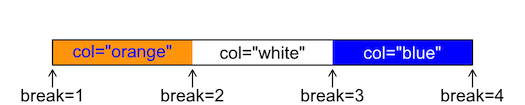
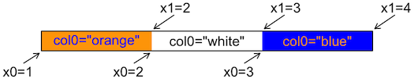

# Calculate a Color Map

Create a mapping between numeric values and colors, for use in palettes
and plots. The return value can be used in various ways, including
colorizing points on scattergraphs, controlling images created by
[`image()`](https://rdrr.io/r/graphics/image.html) or
[`imagep()`](https://dankelley.github.io/oce/reference/imagep.md),
drawing palettes with
[`drawPalette()`](https://dankelley.github.io/oce/reference/drawPalette.md),
etc.

## Usage

``` r
colormap(
  z = NULL,
  zlim,
  zclip = FALSE,
  breaks,
  col = oceColorsViridis,
  name,
  x0,
  x1,
  col0,
  col1,
  blend = 0,
  missingColor,
  debug = getOption("oceDebug")
)
```

## Arguments

- z:

  an optional vector or other set of numerical values to be examined. If
  `z` is given, the return value will contain an item named `zcol` that
  will be a vector of the same length as `z`, containing a color for
  each point. If `z` is not given, `zcol` will contain just one item,
  the color `"black"`.

- zlim:

  optional vector containing two numbers that specify the `z` limits for
  the color scale. This can only be provided in cases A and B, as
  defined in “Details”. For case A, if `zlim` is not provided, then it
  is inferred by using
  [`rangeExtended()`](https://dankelley.github.io/oce/reference/rangeExtended.md)
  on `breaks`, if that is provided, or from `z` otherwise. Also, in case
  A, it is an error to provide both `zlim` and `breaks`, unless the
  latter is of length 1, meaning the number of subdivisions to use
  within the range set by `zlim`. In case B, `zlim` is inferred from
  using
  [`rangeExtended()`](https://dankelley.github.io/oce/reference/rangeExtended.md)
  on `c(x0,x1)`. In case C, providing `zlim` yields an error message,
  because it makes no sense in the context of a named, predefined color
  scheme.

- zclip:

  logical, with `TRUE` indicating that z values outside the range of
  `zlim` or `breaks` should be painted with `missingColor` and `FALSE`
  indicating that these values should be painted with the nearest
  in-range color.

- breaks:

  an optional indication of break points between color levels (see
  [`image()`](https://rdrr.io/r/graphics/image.html)). If this is
  provided, the arguments `name` through `blend` are all ignored (see
  “Details”). If it is provided, then it may either be a vector of break
  points, or a single number indicating the desired number of break
  points to be computed with
  [`pretty`](https://rdrr.io/r/base/pretty.html)`(z,breaks)`. In either
  case of non-missing `breaks`, the resultant break points must number 1
  plus the number of colors (see `col`).

- col:

  either a vector of colors or a function taking a numerical value as
  its single argument and returning a vector of colors. Prior to
  2021-02-08, the default for `col` was `oceColorsJet`, but it was
  switched to `oceColorsViridis` on that date. The value of `col` is
  ignored if `name` is provided, or if `x0` through `col1` are provided.

- name:

  an optional string naming a built-in colormap (one of `"gmt_relief"`,
  `"gmt_ocean"`, `"gmt_globe"` or `"gmt_gebco"`) or the name of a file
  or URL that contains a color map specification in GMT format. If
  `name` is given, then it is passed to
  [`colormapGMT()`](https://dankelley.github.io/oce/reference/colormapGMT.md),
  which creates the colormap. Note that the colormap thus created has a
  fixed relationship between value and color, and `zlim`, only other
  argument that is examined is `z` (which may be used so that `zcol`
  will be defined in the return value), and warnings are issued if some
  irrelevant arguments are provided.

- x0, x1, col0, col1:

  Vectors that specify a color map. They must all be the same length,
  with `x0` and `x1` being numerical values, and `col0` and `col1` being
  colors. The colors may be strings (e.g. `"red"`) or colors as defined
  by [`rgb()`](https://rdrr.io/r/grDevices/rgb.html) or
  [`hsv()`](https://rdrr.io/r/grDevices/hsv.html).

- blend:

  a number indicating how to blend colors within each band. This is
  ignored except when `x0` through `col1` are supplied. A value of 0
  means to use `col0[i]` through the interval `x0[i]` to `x1[i]`. A
  value of 1 means to use `col1[i]` in that interval. A value between 0
  and 1 means to blend between the two colors according to the stated
  fraction. Values exceeding 1 are an error at present, but there is a
  plan to use this to indicate sub-intervals, so a smooth palette can be
  created from a few colors.

- missingColor:

  color to use for missing values. This cannot be provided if `name` is
  also provided (case C), because named schemes have pre-defined colors.
  For other cases, `missingColor` defaults to `"gray"`, if it is not
  provided as an argument.

- debug:

  a flag that turns on debugging. Set to 1 to get a moderate amount of
  debugging information, or to 2 to get more.

## Value

a list containing the following (not necessarily in this order)

- `zcol`, a vector of colors for `z`, if `z` was provided, otherwise
  `"black"`

- `zlim`, a two-element vector suitable as the argument of the same name
  supplied to [`image()`](https://rdrr.io/r/graphics/image.html) or
  [`imagep()`](https://dankelley.github.io/oce/reference/imagep.md)

- `breaks` and `col`, vectors of breakpoints and colors, suitable as the
  same-named arguments to
  [`image()`](https://rdrr.io/r/graphics/image.html) or
  [`imagep()`](https://dankelley.github.io/oce/reference/imagep.md)

- `zclip` the provided value of `zclip`.

- `x0` and `x1`, numerical vectors of the sides of color intervals, and
  `col0` and `col1`, vectors of corresponding colors. The meaning is the
  same as on input. The purpose of returning these four vectors is to
  permit users to alter color mapping, as in example 3 in “Examples”.

- `missingColor`, a color that could be used to specify missing values,
  e.g. as the same-named argument to
  [`imagep()`](https://dankelley.github.io/oce/reference/imagep.md).

- `colfunction`, a univariate function that returns a vector of colors,
  given a vector of `z` values; see Example 6.

## Details

`colormap` can be used in a variety of ways, including the following.

- **Case A.** Supply some combination of arguments that is sufficient to
  define a mapping of value to color, without providing `x0`, `col0`,
  `x1` or `col1` (see case B for these), or providing `name` (see Case
  C). There are several ways to do this. One approach is to supply `z`
  but no other argument, in which case `zlim`, and `breaks` will be
  determined from `z`, and the default `col` will be used. Another
  approach is to specify `breaks` and `col` together, in the same way as
  they might be specified for the base R function
  [`image()`](https://rdrr.io/r/graphics/image.html). It is also
  possible to supply only `zlim`, in which case `breaks` is inferred
  from that value. The figure below explains the (\`breaks\`, \`col\`)
  method of specifying a color mapping. Note that there must be one more
  break than color. This is the method used by e.g. \[image()\].
  

- **Case B.** Supply `x0`, `col0`, `x1`, and `col1`, but *not* `zlim`,
  `breaks`, `col` or `name`. The `x0`, `col0`, `x1` and `col1` values
  specify a value-color mapping that is similar to that used for GMT
  color maps. The method works by using
  [`seq()`](https://rdrr.io/r/base/seq.html) to interpolate between the
  elements of the `x0` vector. The same is done for `x1`. Similarly,
  [`colorRampPalette()`](https://rdrr.io/r/grDevices/colorRamp.html) is
  used to interpolate between the colors in the `col0` vector, and the
  same is done for `col1`. The figure above explains the (\`x0\`,
  \`x1\`, \`col0\`, \`col1\`) method of specifying a color mapping. Note
  that the each of the items has the same length. The case of
  \`blend=0\`, which has color \`col0\[i\]\` between \`x0\[i\]\` and
  \`x1\[i\]\`, is illustrated below. 

- **Case C.** Supply `name` and possibly also `z`, but *not* `zlim`,
  `breaks`, `col`, `x0`, `col0`, `x1` or `col1`. The `name` may be the
  name of a pre-defined color palette (`"gmt_relief"`, `"gmt_ocean"`,
  `"gmt_globe"` or `"gmt_gebco"`), or it may be the name of a file (or
  URL pointing to a file) that contains a color map in the GMT format
  (see “References”). If `z` is supplied along with `name`, then `zcol`
  will be set up in the return value, e.g. for use in colorizing points.
  Another method for finding colors for data points is to use the
  `colfunction()` function in the return value.

## Sample of Usage

    # Example 2. topographic image with a standard color scheme
    par(mfrow=c(1,1))
    data(topoWorld)
    cm <- colormap(name="gmt_globe")
    imagep(topoWorld, breaks=cm$breaks, col=cm$col)

    # Example 3. topographic image with modified colors,
    # black for depths below 4km.
    cm <- colormap(name="gmt_globe")
    deep <- cm$x0 < -4000
    cm$col0[deep] <- "black"
    cm$col1[deep] <- "black"
    cm <- colormap(x0=cm$x0, x1=cm$x1, col0=cm$col0, col1=cm$col1)
    imagep(topoWorld, breaks=cm$breaks, col=cm$col)

    # Example 4. image of world topography with water colorized
    # smoothly from violet at 8km depth to blue
    # at 4km depth, then blending in 0.5km increments
    # to white at the coast, with tan for land.
    cm <- colormap(x0=c(-8000, -4000,   0,  100),
         x1=c(-4000,     0, 100, 5000),
         col0=c("violet","blue","white","tan"),
         col1=c("blue","white","tan","yellow"))
    lon <- topoWorld[["longitude"]]
    lat <- topoWorld[["latitude"]]
    z <- topoWorld[["z"]]
    imagep(lon, lat, z, breaks=cm$breaks, col=cm$col)
    contour(lon, lat, z, levels=0, add=TRUE)

    # Example 5. visualize GMT style color map
    cm <- colormap(name="gmt_globe", debug=4)
    plot(seq_along(cm$x0), cm$x0, pch=21, bg=cm$col0)
    grid()
    points(seq_along(cm$x1), cm$x1, pch=21, bg=cm$col1)

    # Example 6. colfunction
    cm <- colormap(c(0, 1))
    x <- 1:10
    y <- (x - 5.5)^2
    z <- seq(0, 1, length.out=length(x))
    drawPalette(colormap=cm)
    plot(x, y, pch=21, bg=cm$colfunction(z), cex=3)

## References

The following references provide information on choosing colour schemes,
that are suitable for viewers who have colour deficiencies.

Light, Adam, and Patrick J. Bartlein. "The End of the Rainbow? Color
Schemes for Improved Data Graphics." *Eos, Transactions American
Geophysical Union* 85, no. 40 (2004): 385. DOI: 10.1029/2004EO400002

Stephenson, David B. "Comment on 'Color Schemes for Improved Data
Graphics', by A Light and P.J. Bartlein." *Eos, Transactions American
Geophysical Union* 86, no. 20 (2005): 196. DOI: 10.1029/2005EO200005

Light, Adam, and Patrick J. Bartlein. "Reply to 'Comment on Color
Schemes for Improved Data Graphics,' by A. Light and P.J. Bartlein'."
*Eos, Transactions American Geophysical Union* 86, no. 20 (2005):
196–196. DOI: 10.1029/2005EO200006

## See also

Other things related to colors:
[`colormapGMT()`](https://dankelley.github.io/oce/reference/colormapGMT.md),
[`oceColors9B()`](https://dankelley.github.io/oce/reference/oceColors9B.md),
[`oceColorsCDOM()`](https://dankelley.github.io/oce/reference/oceColorsCDOM.md),
[`oceColorsChlorophyll()`](https://dankelley.github.io/oce/reference/oceColorsChlorophyll.md),
[`oceColorsClosure()`](https://dankelley.github.io/oce/reference/oceColorsClosure.md),
[`oceColorsCubeHelix()`](https://dankelley.github.io/oce/reference/oceColorsCubeHelix.md),
[`oceColorsDensity()`](https://dankelley.github.io/oce/reference/oceColorsDensity.md),
[`oceColorsFreesurface()`](https://dankelley.github.io/oce/reference/oceColorsFreesurface.md),
[`oceColorsGebco()`](https://dankelley.github.io/oce/reference/oceColorsGebco.md),
[`oceColorsJet()`](https://dankelley.github.io/oce/reference/oceColorsJet.md),
[`oceColorsOxygen()`](https://dankelley.github.io/oce/reference/oceColorsOxygen.md),
[`oceColorsPAR()`](https://dankelley.github.io/oce/reference/oceColorsPAR.md),
[`oceColorsPalette()`](https://dankelley.github.io/oce/reference/oceColorsPalette.md),
[`oceColorsPhase()`](https://dankelley.github.io/oce/reference/oceColorsPhase.md),
[`oceColorsSalinity()`](https://dankelley.github.io/oce/reference/oceColorsSalinity.md),
[`oceColorsTemperature()`](https://dankelley.github.io/oce/reference/oceColorsTemperature.md),
[`oceColorsTurbidity()`](https://dankelley.github.io/oce/reference/oceColorsTurbidity.md),
[`oceColorsTurbo()`](https://dankelley.github.io/oce/reference/oceColorsTurbo.md),
[`oceColorsTwo()`](https://dankelley.github.io/oce/reference/oceColorsTwo.md),
[`oceColorsVelocity()`](https://dankelley.github.io/oce/reference/oceColorsVelocity.md),
[`oceColorsViridis()`](https://dankelley.github.io/oce/reference/oceColorsViridis.md),
[`oceColorsVorticity()`](https://dankelley.github.io/oce/reference/oceColorsVorticity.md),
[`ocecolors`](https://dankelley.github.io/oce/reference/ocecolors.md)

## Author

Dan Kelley

## Examples

``` r
library(oce)
# Example 1. color scheme for points on xy plot
x <- seq(0, 1, length.out = 40)
y <- sin(2 * pi * x)
par(mar = c(3, 3, 1, 1))
mar <- par("mar") # prevent margin creep by drawPalette()
# First, default breaks
c <- colormap(y)
drawPalette(c$zlim, col = c$col, breaks = c$breaks)
plot(x, y, bg = c$zcol, pch = 21, cex = 1)
grid()

par(mar = mar)
# Second, 100 breaks, yielding a smoother palette
c <- colormap(y, breaks = 100)
drawPalette(c$zlim, col = c$col, breaks = c$breaks)
plot(x, y, bg = c$zcol, pch = 21, cex = 1)
grid()

par(mar = mar)
```
