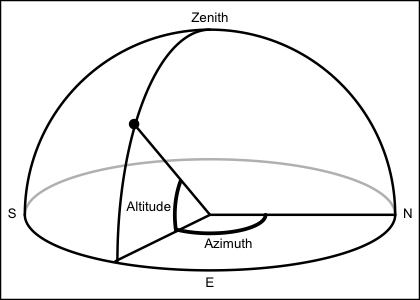

# Solar Angle as Function of Space and Time

This calculates solar angle, based on a NASA-provided Fortran program,
which (according to comments in the code) is in turn based on "The
Astronomical Almanac". Note that `time` may be a single value or a
vector of values; in the latter case, `longitude`, `latitude` and
`useRefraction` are all made to be of the same length as `time`, by
calling [`rep()`](https://rdrr.io/r/base/rep.html). This addresses the
case of finding a time-series of angles at a given spatial location. For
other cases of arguments that are not single values, either call
`sunAngle()` repeatedly or, if that is too slow, use
[`expand.grid()`](https://rdrr.io/r/base/expand.grid.html) to set up
values of uniform length that are then supplied to `sunAngle()`.

## Usage

``` r
sunAngle(t, longitude = 0, latitude = 0, useRefraction = FALSE)
```

## Arguments

- t:

  time, either a POSIXt object (converted to timezone `"UTC"`, if it is
  not already in that timezone), or a value (character or numeric) that
  can be converted to a time with
  [`as.POSIXct()`](https://rdrr.io/r/base/as.POSIXlt.html), assuming the
  timezone to be `"UTC"`.

- longitude:

  observer longitude in degrees east.

- latitude:

  observer latitude in degrees north.

- useRefraction:

  boolean, set to `TRUE` to apply a correction for atmospheric
  refraction.

## Value

A list containing the following:

- `time` the time

- `azimuth`, in degrees eastward of north, from 0 to 360.

- `altitude`, in degrees above the horizon, ranging from -90 to 90.

- `diameter`, solar diameter, in degrees.

- `distance` to sun, in astronomical units.

- `declination` angle in degrees, computed with
  [`sunDeclinationRightAscension()`](https://dankelley.github.io/oce/reference/sunDeclinationRightAscension.md).

- `rightAscension` angle in degrees, computed with
  [`sunDeclinationRightAscension()`](https://dankelley.github.io/oce/reference/sunDeclinationRightAscension.md).
  

## References

Regarding `declination` and `rightAscension`, see references in the
documentation for
[`sunDeclinationRightAscension()`](https://dankelley.github.io/oce/reference/sunDeclinationRightAscension.md).
The other items are based on Fortran code retrieved from the file
`sunae.f`, downloaded from the ftp site
`climate1.gsfc.nasa.gov/wiscombe/Solar_Rad/SunAngles` on 2009-11-1.
Comments in that code list as references:

Michalsky, J., 1988: The Astronomical Almanac's algorithm for
approximate solar position (1950-2050), Solar Energy 40, 227-235

The Astronomical Almanac, U.S. Gov't Printing Office, Washington, D.C.
(published every year).

The code comments suggest that the appendix in Michalsky (1988) contains
errors, and declares the use of the following formulae in the 1995
version the Almanac:

- p\. A12: approximation to sunrise/set times

- p\. B61: solar altitude (AKA elevation) and azimuth

- p\. B62: refraction correction

- p\. C24: mean longitude, mean anomaly, ecliptic longitude, obliquity
  of ecliptic, right ascension, declination, Earth-Sun distance, angular
  diameter of Sun

- p\. L2: Greenwich mean sidereal time (ignoring T^2, T^3 terms)

The code lists authors as Dr. Joe Michalsky and Dr. Lee Harrison (State
University of New York), with modifications by Dr. Warren Wiscombe (NASA
Goddard Space Flight Center).

## See also

The corresponding function for the moon is
[`moonAngle()`](https://dankelley.github.io/oce/reference/moonAngle.md).

Other things related to astronomy:
[`angle2hms()`](https://dankelley.github.io/oce/reference/angle2hms.md),
[`eclipticalToEquatorial()`](https://dankelley.github.io/oce/reference/eclipticalToEquatorial.md),
[`equatorialToLocalHorizontal()`](https://dankelley.github.io/oce/reference/equatorialToLocalHorizontal.md),
[`julianCenturyAnomaly()`](https://dankelley.github.io/oce/reference/julianCenturyAnomaly.md),
[`julianDay()`](https://dankelley.github.io/oce/reference/julianDay.md),
[`moonAngle()`](https://dankelley.github.io/oce/reference/moonAngle.md),
[`siderealTime()`](https://dankelley.github.io/oce/reference/siderealTime.md),
[`sunDeclinationRightAscension()`](https://dankelley.github.io/oce/reference/sunDeclinationRightAscension.md)

## Author

Dan Kelley

## Examples

``` r
rise <- as.POSIXct("2011-03-03 06:49:00", tz = "UTC") + 4 * 3600
set <- as.POSIXct("2011-03-03 18:04:00", tz = "UTC") + 4 * 3600
mismatch <- function(lonlat) {
    sunAngle(rise, lonlat[1], lonlat[2])$altitude^2 + sunAngle(set, lonlat[1], lonlat[2])$altitude^2
}
result <- optim(c(1, 1), mismatch)
lonHfx <- (-63.55274)
latHfx <- 44.65
dist <- geodDist(result$par[1], result$par[2], lonHfx, latHfx)
cat(sprintf(
    "Infer Halifax latitude %.2f and longitude %.2f; distance mismatch %.0f km",
    result$par[2], result$par[1], dist
))
#> Infer Halifax latitude 39.44 and longitude -63.56; distance mismatch 579 km
```
