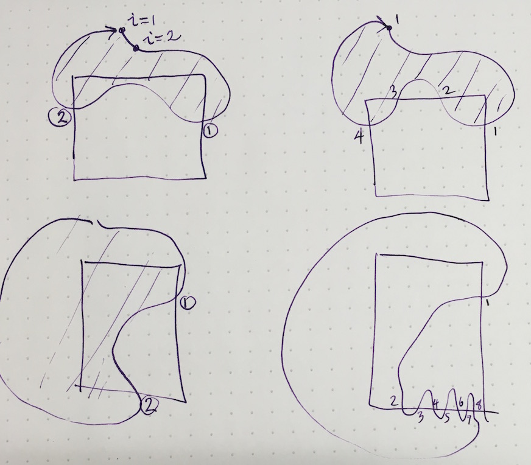

**Abstract.** CL and I have been talking about subsetting coastline files to
those segments that intersect a plotting zone. (R does this automatically for
xy plots, but for mapPlot(), the lon-lat to x-y step that preceeds that is a
waste of time.) The reason is basically speed: especially for shiny apps, it
can be annoying to wait for a long time for a world coastline to be drawn over
a region that is only a few 100km wide. This document proposes a scheme -- I am
looking for feedback on whether I'm mixed up.

It is quite simple to ignore regions that lie entirely outside a plotting zone,
as illustrated by oce/sandbox/coastlineSubset  in the ``develop'' branch of
oce.

Regions that partly intersect a plotting region are trickier to solve, because
quite a lot of time can be wasted on points that go far outside the box.  For
example, a box that covers the Bay of Fundy and surrounding coastline might
bring in a long trace for the main body of continental Canada, and another one
for the USA. It would be sensible to boil all those points down to just a few
that would be sufficient to make the new coastline run *just outside* the plot
box, so that either a line or a polygon fill would represent the coastline,
seen through the plot window.

A possible method is as follows. Consider the diagram given below. I didn't
label the subplots, but call them Figures 1A, 1B, 1C and 1D, in reading order.
In each, the curvy line is intended to be a coastline. Suppose that this is
using a convention that the coastline goes clockwise around the land. (All of
what I say can be reversed for the opposite convention. Note that I am not --
yet -- thinking about lakes within land!)

Consider Fig 1A. In my proposed method, we trace along from i=1, and find at
the point labelled (1) (well, circled 1, actually) that the line has crossed
into the box. We keep following the line until it exits the box. Let's denote
that exit point as (2). I propose we walk along along the plot-region sides,
starting at (2) until we get back to (1). Now, imagine taking all the coastline
points that lie to the left of box side 2 and below side 3 as being at the
proper ``y'' but with an ``x'' that is just to the left of side 2. (I am using
R notation to name sides.) Similarly, we move the points that are above the top
side (side 3) to have the correct ``x'' and a ``y'' that is just above side 3.
The points that are in the corner region at top-left can be remapped to a point
outside the top-left corner.) We continue this, down along side 4 (the
right-hand side). We have warped the coastline to run just outside the box, in
a *straight* line. Now, we don't actually need all those points on the line. We
can put a single point to the left of (2), and connect it to this
outside-corner point at top left, then to a similar corner at top right, and
finally to a point just to the right of (1). We can thus remove possibly
thousands of points, replacing them with 3 points.

I think that will work on other sides as well -- it's just a matter of keeping
track.

Now move to Fig 1B. This is like Fig 1A except that we have a second entry at
point (3). But I think a similar scheme of outside points will work.

The other diagrams are a bit more complicated. But I think a general scheme can
be devised that will handle all such cases. The basic idea is to look for entry
and leaving points, and to create fake outside points as needed. I suppose a
simple way is to do literally what I said above: create all those outside
points, and then find sequences points that are along horizontal and vertial
lines, and boil them down to just two points each. (I do a scheme like that in
the ``gri'' language, because the output from gri is postscript, and when
postscript was invented, there was a limit of 1500 points in a connected line!)

This would be way easier to talk about in person, of course.

**Question** does this scheme seem possible, in principle?

