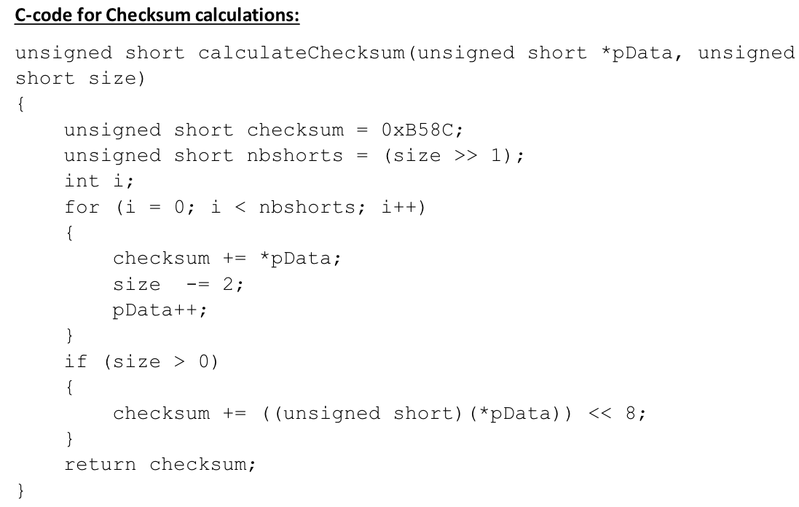

## Test case




Ref 3 on page 8 states that the checksum of the sequence a5 21 4f 00 45 17 14
15 20 05 00 00 00 00 92 00 is b4e0.  The endianness is unstated, but I tried
both possibilities, and it is the second, i.e. b2 below, not the b1 that is
written in Ref 3.

```{r}
b1 <- as.raw(c(
        0xa5, 0x21, 0x4f, 0x00, 0x45, 0x17, 0x14, 0x15,
        0x20, 0x05, 0x00, 0x00, 0x00, 0x00, 0x92, 0x00))
b2 <- as.raw(c(
        0x21, 0xa5, 0x00, 0x4f, 0x17, 0x45, 0x15, 0x14,
        0x05, 0x20, 0x00, 0x00, 0x00, 0x00, 0x00, 0x92))

writeBin(b1, "b1", size=1L, useBytes=TRUE)
B1 <- readBin("b1", "raw", length(b1))
stopifnot(identical(b1, B1))
writeBin(b2, "b2", size=1L, useBytes=TRUE)
B2 <- readBin("b2", "raw", length(b2))
stopifnot(identical(b2, B2))
```

## Code based on Reference 3

The local file `checksum.c` holds a version of the Nortek code written to
modern C standards (with specified-length types).  It is given in the
Appendix.  Running it on the `b1` file produced with R code as above does
not retrieve the same checksum as Nortek states, but using `b2` yields
agreement.  In other words, Nortek is (confusingly!) writing bytes in
little-endian order.

## References

1. Nortek AS. “Signature Integration 55|250|500|1000kHz.” Nortek AS, 2017.
  https://www.nortekgroup.com/assets/software/N3015-007-Integrators-Guide-AD2CP_1018.pdf.

2. Nortek AS. “Signature Integration 55|250|500|1000kHz.” Nortek AS, March 31,
   2022.

3. Nortek AS. “Classic Integrators Guide: Aquadopp | Aquadopp DW | Aquadopp
   Profiler | HQ Aquadopp Profiler | Vector | AWAC.” Nortek AS, 2022.
   https://support.nortekgroup.com/hc/en-us/articles/360029514052-Integrators-Guide-Classic.

4. Nortek AS. “Signature Integration 55|250|500|1000kHz.” Nortek AS, 2017.
   https://www.nortekgroup.com/assets/software/N3015-007-Integrators-Guide-AD2CP_1018.pdf.


## Appendix

`checksum.c` follows
```C
#include <stdio.h>
#include <stdlib.h>

short ChecksumORIG(short *phBuff, int n) {
    int i;
    short hChecksum = 0xb58c;
    for (i=0; i<n; i++)
        hChecksum += phBuff[i];
    return hChecksum;
}

// This follows the pattern of Page 79 of Ref 3, but with specified types, to
// avoid possibly problems porting the nortek code, which has unstated
// assumptions (on endianness, on the size of a 'short', etc.
int16_t nortek_checksum(uint16_t *phBuff, int n) {
    uint32_t hChecksum = 0xb58c; // I think this is large enough
    uint16_t res;
    printf("checksum(buffer, n=%d)\n", n);
    printf(" start with 0x%04x\n", hChecksum);
    for (int i=0; i<n; i++) {
        hChecksum += phBuff[i];
        printf(" add 0x%04x to get 0x%08x\n", phBuff[i], hChecksum);
    }
    res = hChecksum % 0xffff;
    return res;
}


int main(int argc, char **argv)
{
    FILE *in;
    int32_t len;
    unsigned char *buf;
    uint16_t *buf2;
    uint16_t cs2;
    if (argc != 2) {
        printf("ERROR: give a filename\n");
        exit(1);
    }
    in = fopen(argv[1], "rb");
    fseek(in, 0, SEEK_END);
    len = ftell(in);
    rewind(in);
    buf = (unsigned char*)malloc(len*sizeof(unsigned char));
    fread(buf, 1, len, in);
    printf("buf[0:%d]: ", len-1);
    for (int32_t i = 0; i < len; i++)
        printf("0x%x ", buf[i]);
    printf("\n");
    // read 2 bytes at a time
    rewind(in);
    buf2 = (uint16_t*)malloc(len/2*sizeof(uint16_t));
    fread(buf2, 2, len/2, in);
    cs2 = nortek_checksum(buf2, len/2);
    printf("computed checksum: 0x%04x (expect 0xb4e0)\n", cs2);
    fclose(in);
}
```


