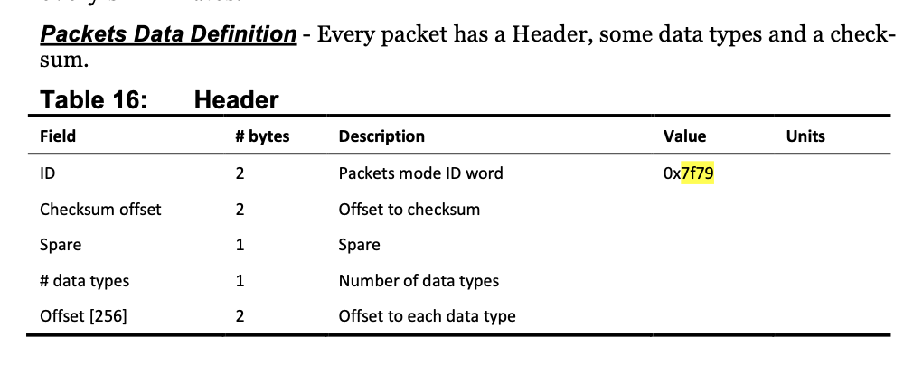

# Introduction

For issue [2216](https://github.com/dankelley/oce/issues/2216), a user
sent a file to me privately.  We had some discussion at that issue and
over email, about my attempts to read the file.  Below are some notes
on that.  (The file is private, and has been renamed for that reason.)

# How does the file start?

According to RDI documentation in my possession (from a few months
ago, see References, and going back to which 2006), the first two
bytes of an RDI file must be 0x7f 0x7f. Using `od` to inspect the
file,

```
od -x ~/Downloads/oce2216.000|head -1
```
yields
```
0000000      797f    0056    0100    0008    0103    2932    41cc    b023
```
so, clearly, this file does not match the 7f7f expectation. But we've
seen a file like this before, and concluded that it holds wave data.
So let's try coding that.


I tried the format from Reference 1, viz.



so I tried code as below.  I don't have much to cross-reference this,
but the numbers do not seem like garbage (as would be the case if I
was not counting bytes correctly).

```{r}
library(oce)
f <- "~/Downloads/oce2216.000"
buf <- readBin(f, "raw", n = 1e4)
i <- 1
if (buf[i] == 0x7f && buf[i + 1] == 0x79) {
    cat("Got 0x7f 0x79 (for waves type) see wavemon manual section 4.5 table 16\n")
    i <- i + 2
    checksumOffset <- readBin(buf[i + 0:1], "integer", n = 1, size = 2)
    cat(" ", vectorShow(checksumOffset))
    i <- i + 2
    spare <- buf[i]
    cat(" ", vectorShow(spare))
    i <- i + 1
    numberOfDataTypes <- readBin(buf[i], "integer", n = 1, size = 1)
    cat(" ", vectorShow(numberOfDataTypes))
    i <- i + 1
    offset <- readBin(buf[i + 0:1], "integer", n = 1, size = 2)
    cat(" ", vectorShow(offset))
    buf[offset + 2]
    i <- offset + 1
    if (buf[i] == 0x03 && buf[i + 1] == 0x01) {
        i <- i + 2
        cat("  First Leader Type at index ", i, "\n")
        firmwareVersion <- readBin(buf[i + 0:1], "integer", size = 2)
        cat(" ", vectorShow(firmwareVersion, postscript = "(how to decode?)"))
        i <- i + 2
        configuration <- buf[i + 0:1]
        cat(" ", vectorShow(configuration, postscript = "(binary)"))
        i <- i + 2
        nbins <- as.integer(buf[i])
        cat(" ", vectorShow(nbins))
        i <- i + 1
        samplesPerBurst <- readBin(buf[i + 0:1], "integer", size = 2)
        cat(" ", vectorShow(samplesPerBurst))
        i <- i + 2
        binLength <- 0.01 * readBin(buf[i + 0:1], "integer", size = 2)
        cat(" ", vectorShow(binLength, postscript="cm"))
        i <- i + 2
        TBP <- 0.01 * readBin(buf[i + 0:1], "integer", size = 2)
        cat(" ", vectorShow(TBP, postscript="s"))
        i <- i + 2
        TBB <- 0.01 * readBin(buf[i + 0:1], "integer", size = 2)
        cat(" ", vectorShow(TBB, postscript="s"))
        i <- i + 2
    } else {
        cat("  ERROR: want 0x01 0x03 (first leader) but got 0x",
            buf[i], " 0x", buf[i + 1], "\n",
            sep = ""
        )
    }
}
```

# References

1. Teledyne RD Instruments. “WavesMon v3.08 User’s Guide.” Teledyne RD
   Instruments, November 2011.
   https://www.comm-tec.com/Docs/Manuali/RDI/WavesMon%20Users%20Guide.pdf.

